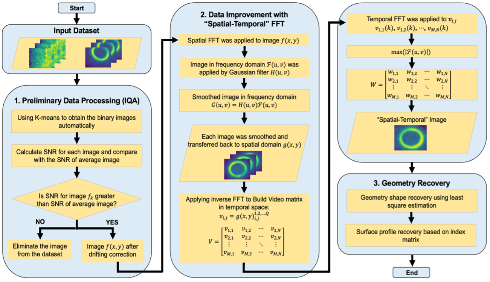
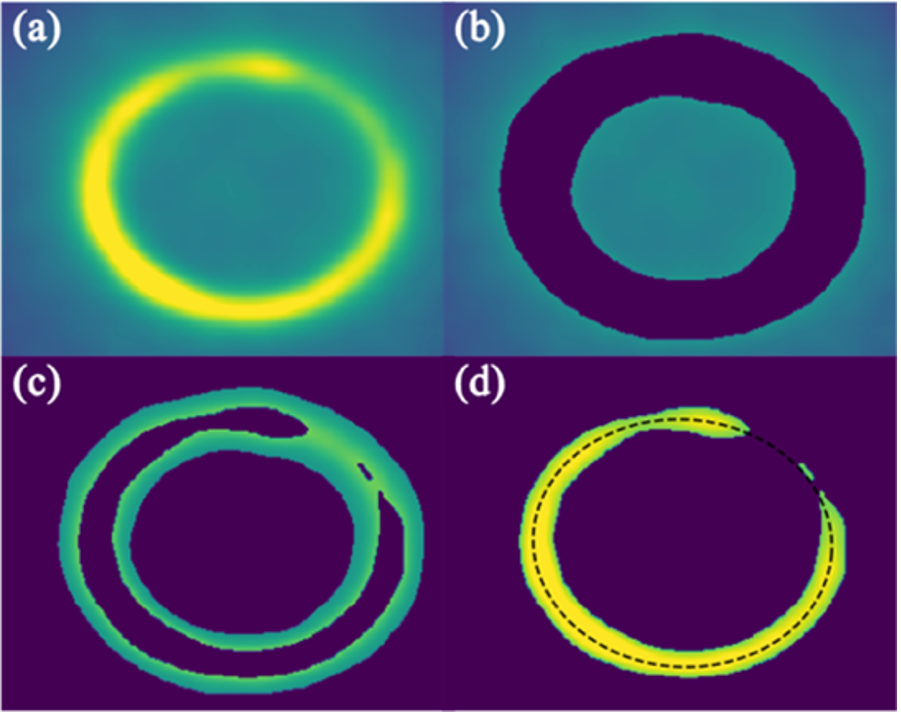
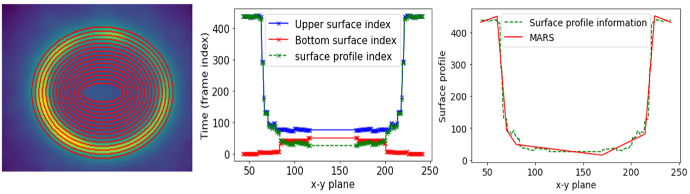
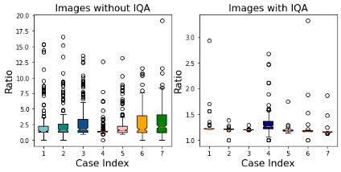

# ST-FFT: Spatial-Temporal Fast Fourier Transform for Manufacturing Thermography

Data-quality improvement and geometric-information recovery for in-situ thermal
videos. This repository implements the method from:

> **Data Quality Improvement and Geometric Information Recovery for Manufacturing
> Thermography with Spatial-Temporal Fast Fourier Transform**
> Boyang Xu and Shenghan Guo
> School of Manufacturing Systems and Networks, Arizona State University, Mesa, AZ, USA

## Overview

Geometric information is crucial for evaluating manufacturing part quality.
Traditional evaluation relies on *destructive* testing. Infrared (IR)
thermography offers a non-destructive alternative — but raw thermal videos
from real production suffer from low resolution, noisy radiation, uninformative
early frames, and part drift caused by camera shake.

Crucially, a thermal video carries a **spatial-temporal pattern**: the spatial
relationships among pixels within a frame, *and* the temporal evolution of the
part across frames. Neither can be ignored when recovering geometry. Generic
image-denoising and 3D-reconstruction methods discard this structure (and often
demand multi-view rigs or heavy deep models).

**ST-FFT** is a lightweight framework that improves thermal-image quality while
*preserving* the spatial-temporal pattern, and recovers a **functional**
(analytic) description of the part's geometry. It is validated on in-situ
thermal videos of lab-based **resistance spot welding (RSW)** and is readily
generalizable to other processes such as laser-based additive manufacturing.

## Method
<p align="center">
  
  <br>
  <em>Figure 1. The three-stage ST-FFT framework.</em>
</p>

The framework has three stages; ST-FFT itself is the IQI core of stage 2.

```
 raw thermal video  ──►  (1) IQA  ──►  (2) ST-FFT (IQI)  ──►  (3) geometry recovery
                          frame                spatial+temporal      top-down ellipse
                          filtering            denoising & fusion    + side-view profile
                          + drift fix
```

### 1. Image Quality Assessment — `stfft.iqa`, `stfft.segmentation`, `stfft.drift`

- **Uninformative-frame elimination.** A reference image is formed by averaging
  all frames. K-means binarization (object vs. background) defines signal and
  noise regions, and the **SNR** (mean-square of the part over mean-square of
  the background) is computed per frame. Frames whose SNR falls below the
  reference SNR are discarded.
- **Drift correction.** Each kept frame is registered to the reference by
  locating the peak of the FFT phase cross-correlation, then shifted back by
  the estimated displacement.

### 2. ST-FFT quality improvement — `stfft.transform`

- **FFT-S (spatial).** Each frame is transformed by 2D FFT and multiplied by a
  Gaussian low-pass filter, suppressing high-frequency sensor noise and
  smoothing the frame — this preserves and strengthens the *spatial* pattern.
- **FFT-T (temporal).** A 1D FFT is taken along the time axis for every pixel;
  the peak spectral magnitude is kept, fusing the whole stack into a single
  reinforced **"ST-FFT image"** that preserves the *temporal* evolution.

### 3. Geometry recovery — `stfft.geometry`, `stfft.profile`

- **Top-down view (boundary shape).** The ST-FFT image is segmented with
  **K-means (K = 3)** — separating background, halo, and the weld-nugget part —
  for a cleaner contour. The nugget boundary is extracted and fit to an
  **ellipse** via direct least squares (Halir & Flusser), yielding center,
  semi-major / semi-minor axes, eccentricity and orientation.
- **Side view (surface profile).** A per-pixel **index matrix** (the frame at
  which each pixel peaks) encodes how the surface stabilizes over time.
  Concentric contours are sampled by shrinking the fitted ellipse, giving
  upper/lower index profiles whose difference is a data-driven surface profile.
  The paper fits this with **MARS**; a dependency-free degree-7 polynomial fit
  is provided here as a drop-in approximation.

## Key results (from the paper's RSW case study)
<p align="center">
  
  <br>
  <em>K-means Segmentation and Geometry Recovery Results.</em>
</p>

<p align="center">
  
  <br>
  <em>The performance for geometry from “side” view.</em>
</p>

Seven thermal videos of joined Boron-steel sheets, frames enlarged to 3.5× the
original size.

| Metric | Without IQA | With IQA / ST-FFT |
|---|---|---|
| ST-FFT image SNR (raw → elim. → +drift) | 3.78 | 7.07 → **7.16** |
| Coefficient of variation of the axis ratio | 0.8491 | **0.0694** |
| Avg. geometry-recovery time | 2241 s (IQA, no FFT) | **32 s** (IQA + FFT) |

The recovered weld-nugget ellipse had its center at (140.51, 109.17) with
semi-major / semi-minor axes of 87.74 / 72.70. IQA makes the recovered ratio
far more stable, and adding ST-FFT makes it both the most accurate **and**
roughly **70× faster**.

<p align="center">
  
  <br>
  <em>Figure 1. Box plot for geometry shape recovery ("top-down” view). </em>
</p>

## Installation

```bash
git clone https://github.com/BoyangASU/geometry-recovery.git
cd geometry-recovery
pip install -e .                 # core package
pip install -e ".[notebook]"     # + jupyter / seaborn / tqdm for the demo
```

Requires Python ≥ 3.9. Core dependencies: NumPy, SciPy, OpenCV, pandas,
matplotlib.

## Quick start

```python
import stfft

# video: a (H, W, T) NumPy array of grayscale thermal frames
out = stfft.run_pipeline(video, k=2, k_geom=3, cutoff=30.0, do_drift=True)

g = out["geometry"]
print(g["x0"], g["y0"])          # ellipse center
print(g["ap"], g["bp"])          # semi-major / semi-minor axes
print(g["eccentricity"])
enhanced = out["enhanced"]       # the ST-FFT image
kept = out["kept_frames"]        # frame indices retained by IQA
```

### Loading your own data

```python
from stfft import io

# a folder of per-frame PNGs, cropped to the region of interest
video = io.load_png_sequence("data/RSW_case1", crop=(36, 244, 84, 350))

# or CSV temperature frames
video = io.load_csv_sequence("data/RSW_case1_csv")
```

### Step-by-step control

```python
import numpy as np
import stfft

# --- (1) IQA ---
reference = np.mean(video, axis=2)
obj = stfft.segmentation.kmeans_threshold(reference, k=2)
_, signal, noise = stfft.segmentation.object_pixels(obj)

ref_snr = stfft.iqa.snr(reference, signal, noise)
scores = stfft.iqa.assess_video(video, signal, noise)
filtered, kept = stfft.iqa.select_frames(video, scores, ref_snr)
corrected, shifts = stfft.drift.correct_video(filtered)

# --- (2) ST-FFT ---
enhanced, _ = stfft.transform.st_fft(corrected, cutoff=30.0)

# --- (3a) top-down ellipse ---
binary, *_ = stfft.segmentation.object_pixels(
    stfft.segmentation.kmeans_threshold(stfft.transform.normalize(enhanced), k=3)
)
geom = stfft.geometry.recover_geometry(binary)

# --- (3b) side-view surface profile ---
idx = stfft.profile.index_matrix(corrected)
xs, upper, lower = stfft.profile.sample_contours(
    idx, (geom["x0"], geom["y0"]), geom["ap"], geom["bp"], n_steps=75
)
profile = stfft.profile.surface_profile(upper, lower)
poly, fitted = stfft.profile.fit_profile(xs, profile, degree=7)
```

## Demo notebook

[`notebooks/demo.ipynb`](notebooks/demo.ipynb) runs the full pipeline on a
**synthetic thermal video**, so it works out of the box without the private
dataset. It walks through each stage with plots and ends with the one-line
`run_pipeline` wrapper.

```bash
jupyter notebook notebooks/demo.ipynb
```

## Repository layout

```
geometry-recovery/
├── src/stfft/
│   ├── __init__.py        # public API + run_pipeline()
│   ├── io.py              # load PNG / CSV frame sequences
│   ├── iqa.py             # SNR scoring & frame selection
│   ├── segmentation.py    # 1D k-means intensity thresholding (K=2 / K=3)
│   ├── drift.py           # FFT phase cross-correlation drift correction
│   ├── transform.py       # FFT-S + FFT-T (the ST-FFT)
│   ├── geometry.py        # top-down ellipse fitting
│   └── profile.py         # side-view surface-profile recovery
├── notebooks/
│   └── demo.ipynb         # runnable end-to-end demo (synthetic data)
├── pyproject.toml
├── requirements.txt
└── README.md
```

## Notes on the data

The original RSW case studies use proprietary thermal videos and are not
included here. Point `stfft.io` at your own frame directories, or use the
synthetic generator in the demo notebook as a template. `.gitignore` excludes
`data/`, `*.csv`, and `*.xlsx` so raw acquisitions are never committed.

## Citation

```bibtex
@article{xu_stfft,
  title   = {Data Quality Improvement and Geometric Information Recovery for
             Manufacturing Thermography with Spatial-Temporal Fast Fourier Transform},
  author  = {Xu, Boyang and Guo, Shenghan},
  note    = {School of Manufacturing Systems and Networks, Arizona State University}
}
```

## License

MIT — see [LICENSE](LICENSE).
